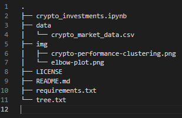

# Welcome to the Global Crypto Behavior (GCB) Index WebApp!
***
## <a id="Contents">Cotents</a>
[Project Description](#Project-Description) 
[Technologies and Resources](#Technologies-Resources) 
[Installation Guide](#Installation-Guide) 
[Usage](#Usage) 
[Contributors](#Contributors) 
[License](#License) 
[Bottom of Page](#Bottom-of-Page) 

***
## <a id="Project-Description">Project Description</a>
This WebApp provides an index for cryptocurrencies and analyzes global behavior. It does this by corralating crypto price and exchange data with crypto related news publications. The hope of this endevor is to provide our users with interactive visualizations of global cryptocurrency behavior to assist the users own investment decisions. We draw correlations between news sources, crypto prices, and periodic returns, which suggest that major news events shape public perceptions and influce investment decisions. 

#### Project layout:
The layout of this project is show below.

***
## <a id="Technologies-Resources">Technologies and Resources</a>
#### Technologies:
<a href="https://docs.python.org/release/3.8.0/" title="https://docs.python.org/release/3.8.0/">

 

#### Resources:
 - <a href="https://cryptonews-api.com/" title="https://cryptonews-api.com/" target="_blank">Crypto News API</a>
 - <a href="https://coinmarketcap.com/api/" title="https://coinmarketcap.com/api/" target="_blank">CoinMarketCap API</a>

***
## <a id="Installation-Guide">Installation Guide</a>
### Project Installation
To install <a href="https://github.com/Fintech-Collaboration/global-crypto-behavior.git" title="https://github.com/Fintech-Collaboration/global-crypto-behavior.git">global-crypto-behavior</a>, type <code>git clone https://github.com/Fintech-Collaboration/global-crypto-behavior.git</code> into bash in your prefered local directory.  
Alternatively, you can navigate to the same address (<code>https://github.com/Fintech-Collaboration/global-crypto-behavior.git</code>) and download the full <code>main</code> branch's contents as a zip file to your prefered local directory. 

## <a id="Usage">Usage</a>
To run the gcb-index-lite WebApp, in a terminal in the project's base directory, execute the command: 
<code>voila --template=flex gcb-index-lite.ipynb</code>  

## <a id="Contributors">Contributors</a>
 - <a href="https://github.com/Danieli2" title="https://github.com/Danieli2" target="_blank">Daniel de Leon</a>
 - <a href="https://github.com/jasonjgarcia24" title="https://github.com/jasonjgarcia24" target="_blank">Jason Garcia</a>
 - <a href="https://github.com/nssensalo" title="https://github.com/nssensalo" target="_blank">Nansamba Ssensalo</a>
 - <a href="https://github.com/wdolesin" title="https://github.com/wdolesin" target="_blank">William Olesinski</a>

## <a id="License">License</a>
Each file included in this repository is licensed under the <a href="https://github.com/Fintech-Collaboration/global-crypto-behavior/blob/a421d91abfc34f96b1f85b34095d28631a427e89/LICENSE" title="LICENSE">MIT License.</a>

***
[Top of Page](#Top-of-Page) 
[Contents](#Contents) 
[Project Description](#Project-Description) 
[Technologies and Resources](#Technologies-Resources) 
[Installation Guide](#Installation-Guide) 
[Usage](#Usage) 
[Contributors](#Contributors) 
[License](#License) 

