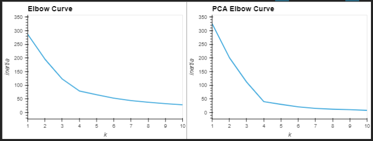
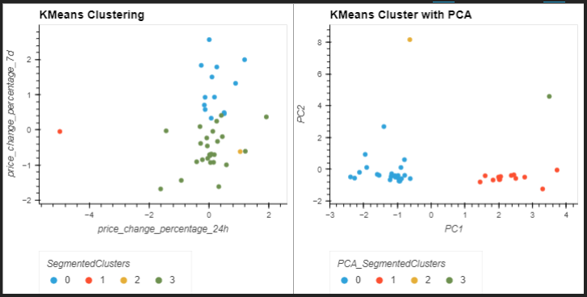

# Welcome to the Machine-Learning (ML) Performance Clustering Project!
***
## <a id="Contents">Cotents</a>
[Project Description](#Project-Description) 
[Technologies and Resources](#Technologies-Resources) 
[Installation Guide](#Installation-Guide) 
[Usage](#Usage) 
[Contributors](#Contributors) 
[License](#License) 
[Bottom of Page](#Bottom-of-Page) 

***
## <a id="Project-Description">Project Description</a>
This project applies financial analysis experience combined with unsupervised machine-learning to classify cryptocurrency performance throughout time. 

Using unsupervised learning, this project makes sense of the unlclassified datasets by extracting features and patterns on its own. These operations are performed by utilizing dimensionality reduction and clustering, Principal Component Analysis (PCA) and K-Means respectively. 

Following the classification of the performance, this project presents visualizations to trend the performance over time.  

#### Project layout:
The layout of this project is show below. 
. 
├── crypto_investments.ipynb 
├── data 
│   └── crypto_market_data.csv 
├── img 
│   ├── crypto-performance-clustering.png 
│   └── elbow-plot.png 
│   └── project_tree.png 
├── LICENSE 
├── README.md 
├── requirements.txt 
└── tree.txt 

***
## <a id="Technologies-Resources">Technologies and Resources</a>
#### Technologies:
<a href="https://docs.python.org/release/3.8.0/" title="https://docs.python.org/release/3.8.0/">

    
     

***
## <a id="Installation-Guide">Installation Guide</a>
### Project Installation
To install <a href="https://github.com/jasonjgarcia24/ml-performance-clustering.git" title="https://github.com/jasonjgarcia24/ml-performance-clustering.git">ml-performance-clustering</a>, type <code>git clone https://github.com/jasonjgarcia24/ml-performance-clustering.git</code> into bash in your prefered local directory.  
Alternatively, you can navigate to the same address (<code>https://github.com/jasonjgarcia24/ml-performance-clustering.git</code>) and download the full <code>main</code> branch's contents as a zip file to your prefered local directory. 

## <a id="Usage">Usage</a>
Observe price-dislocation with <code>crypto_investments.ipynb</code>. No input variables are required. 

### Outputs
This tool provides several necessary visualizations for Cryptocurrency performance analysis:
1. K versus Inertia plots for both price change percentage of 24 hours versus 7 days and the PCA data: 
 
These inertia plots allow us to measure the distribution of the data within a cluster given the K values. 

2. Scatter plots of both the original dataset and the PCA clusters following dimensionality reduction: 
 

***
## <a id="Contributors">Contributors</a>
Currently just me :) 

***
## <a id="License">License</a>
Each file included in this repository is licensed under the <a href="https://github.com/jasonjgarcia24/ml-performance-clustering/blob/2370b0c29d2c11c57d7c41d581612a5ca8c35503/LICENSE" title="LICENSE">MIT License.</a>

***
[Top of Page](#Top-of-Page) 
[Contents](#Contents) 
[Project Description](#Project-Description) 
[Technologies and Resources](#Technologies-Resources) 
[Installation Guide](#Installation-Guide) 
[Usage](#Usage) 
[Contributors](#Contributors) 
[License](#License) 

